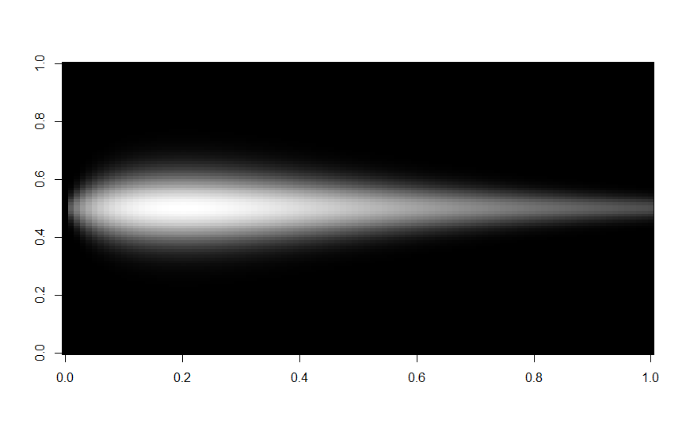
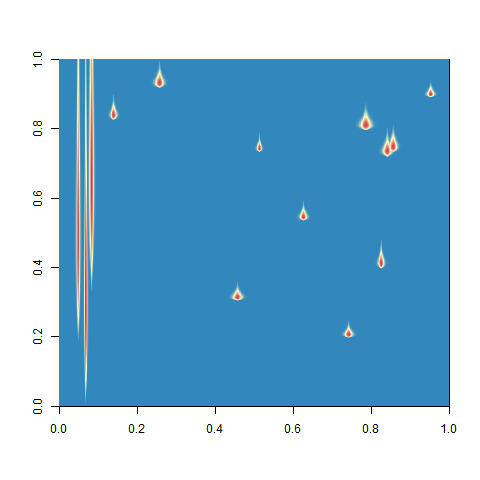

# MMS-Modelling

## Purpose

Qualification assignment to allows MMS team better understanding interests and capabilities.

## Contents

- _local/_ : contains files will be not upload in order to complain to confidential rules ;
- _main.R_ : contains script to parameter, build and export simulation containing features ;
- _output/_ : contains exports from the simulation execution plotting the result of a single iteration.

## Function modelling individual features

### Identification

```R
generate_feature <- function(height, width, minValue, maxValue) {
  y <- dgamma(seq(0, 25, by = 25 / (height - 1)), 2, 0.2)
  xy <- matrix(NA, height, width)
  for (pos in seq(height)) {
    x <- dnorm(seq(-1.5, 1.5, by = 3 / (width - 1)), 0, y[pos] * 2)
    x <- x / max(x) * y[pos]
    x[is.nan(x)] <- 0
    xy[pos, ] <- x
  }
  xy <- scale_feature(xy, minValue, maxValue)
  return(xy)
}
```

### Description

- `dgamma` : The Poisson distribution is discontinuous, whereas the Gamma distribution is continuous. We use the Gamma distribution with parameters allowing to approach the probability density of the Poisson distribution while taking advantage of the continuity of the former.
- `seq(0, 25, by = 25 / (height - 1))` : We want to obtain 25 values equidistributed along the height of the feature (it is not necessary to obtain more than 25 values).
- `for (pos in seq(height))` : The sequence of height values forms a support for the addition of width data.
- `dnorm` : The feature width (`x`) is defined by a Normal distribution whose standard deviation varies along the feature height (`y`).
- `x <- x / max(x) * y[pos]` : The intensity of the `x`-axis is proportional to that of the `y`-axis. This correction is necessary because the higher the intensity of `y` is, the more the intensity of `x` would be decreased (because of the standard deviation) without this correction.
- `x[is.nan(x)] <- 0` : Absent values are replaced by a numerical null value.
- `xy[pos, ] <- x` : We apply the values of the generated vector to a line of width.
- `scale_feature` : The values of the feature are scaled according to the limits indicated to integrate it into the canvas in the future.

### Possible improvements

1. For simplicity/efficiency it was chosen to spread the gamma law for obtaining line features from the `generate_feature` function. This could be an improvement for this script.

### Abbreviations used

- Gaussian (G)
- super-Gaussian (SG)
- Poisson (P)
- the size of a side of the picture (N)

### Answered questions

1. How to determine the position of the points ? Is it from a Gaussian (G), super-Gaussian (SG), or Poisson (P) probability density function ?
   => **The starting position of the point features have been determined by the sampling of an integer among a vector.**
2. I think it would be necessary for step 1.2 for all the positions of our Ofeat objects, and not one by one, in order to have a more homogeneous distribution and to avoid repetition bias. What do you think ?
   => **Impact of repetition bias have not been proper evaluated. The simplest solution (which is to say, the determination one by one of the position of each features) is still used, as we already see a homogeneous distribution.**
3. About the step 5, as a Gaussian distribution is continuous in infinity, I wonder if it will add noise on the whole picture for each object. Should I truncate my data from this distribution from a certain percentile? If yes which one (+/- 1,9774) ?
   => **In the output result it has been observed that the noise added on the whole picture for each features is not significant.**
4. About the step 5, I am not sure if the modification of the standard deviation only will be enough to get something smooth. It may be smoother to define the mean in addition to the standard deviation. Or maybe I should only set the mean, what do you think ?
   => **Standard deviation was modified in comparison to the default value : ((mean,sd) = (0,1) to (0, y[pos] \* 2)).**
5. What programming language do you want me to use ?
   => **Whereas in the step 1 the definition of an object (`Ofeat`) was considered, which should have lead to a script in Python language, the R language was used cause of a better knowledge of the built-in functions.**

## Second script

### Results

- One feature :



- Three long features and twelve point features :


